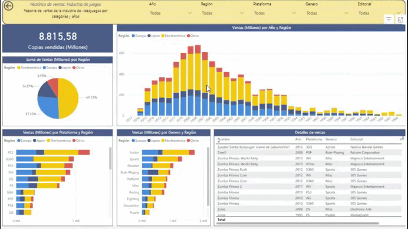

# Portafolio de proyectos -  Power BI 

¡Bienvenido a mi repositorio personal de Power BI! Aquí encontrará una colección de proyectos y paneles de Power BI que demuestran mis habilidades y experiencia en visualización de datos, inteligencia empresarial y análisis con Power BI.

## [Proyecto 0: Informe de denuncias](https://app.powerbi.com/view?r=eyJrIjoiY2Y5NmM2MTQtNmNjMS00NmQ5LWE2MmQtMjRmZTQzM2FmNTBkIiwidCI6ImU4MjE0OTM3LTIzM2ItNGIzNi04NmJmLTBiNWYzMzM3YmVlMSIsImMiOjF9&embedImagePlaceholder=true)

Informe de denuncias presenta estadísticas para identificar las denuncias por comuna, las denuncias por motivo y las denuncias por rubro para la ciudad de Buenos Aires. 

## [Proyecto 1: Industria de videojuegos]()
Reporte interactivo para analizar las ventas de millones de copias de videojuegos a nivel global.
Se analizan por las categorías de año, región, plataforma, género y editorial.

## Licencia

Este repositorio forma parte del curso de [Udemy](https://www.udemy.com/) titulado **Curso Power BI – Análisis de Datos y Business Intelligence**, impartido por **Javier Gómez**.

### Autor
Este repositorio fue creado basado en el aprendizaje en el curso de Udemy **Análisis de Datos y Business Intelligence**.

- Instructor: [Javier Gómez](https://www.udemy.com/user/egpjavier/)
- Más información sobre el curso: [Análisis de Datos y Business Intelligence](https://www.udemy.com/course/power-bi-analisis-datos-business-intelligence/?couponCode=24T4MT92724B)
